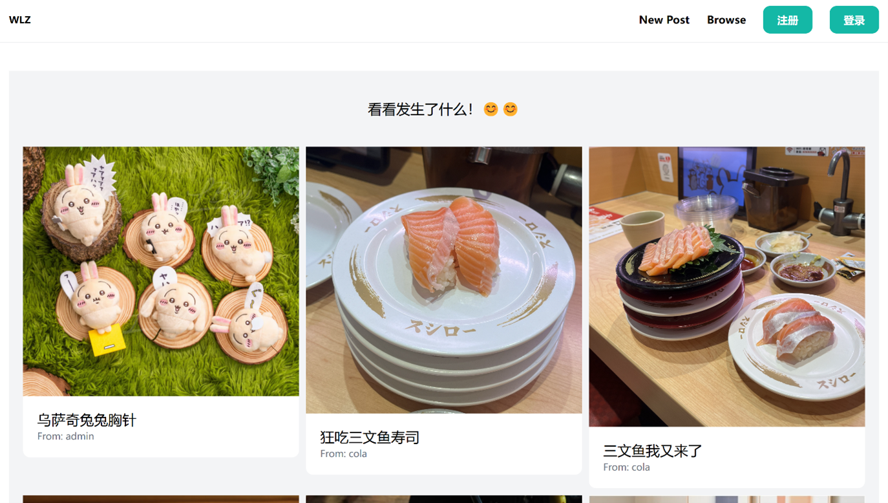
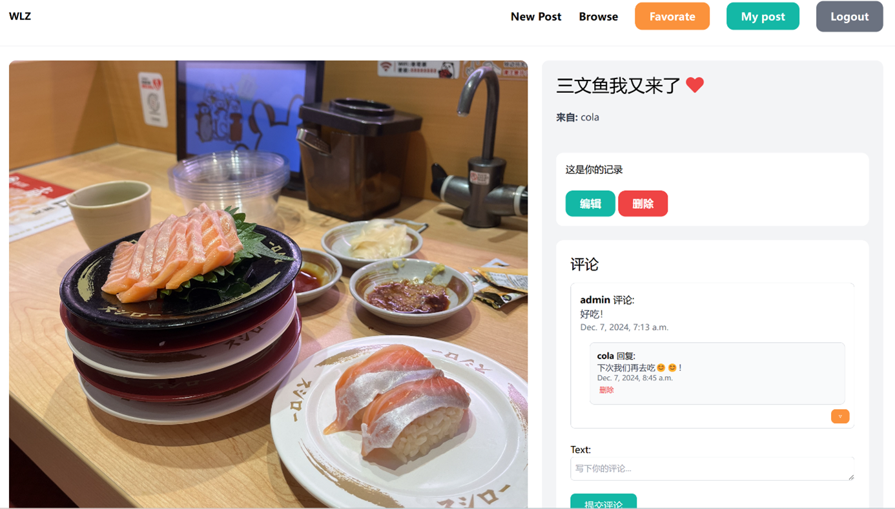

数据库课设，根据这个仓库改编的：https://github.com/SteinOveHelset/puddle 

Django+MySQL的照片分享平台

**功能：**

1) 用户账户管理功能：实现用户登录，注册和登出功能。
2) 照片分享功能：允许按照片的分类，标题，描述进行照片上传。
3) 互动功能：用户可以对发布的照片进行评论和收藏，也可以对评论进行回复。
4) 浏览和搜索功能：用户能够浏览不同分类的照片，并通过关键词搜索照片。用户收藏的照片，以及自己发布的照片可以在单独的页面访问。
5) 内容管理：用户可以管理自己的帖子和评论，包括编辑和删除，也可以取消收藏照片。

**界面：**

